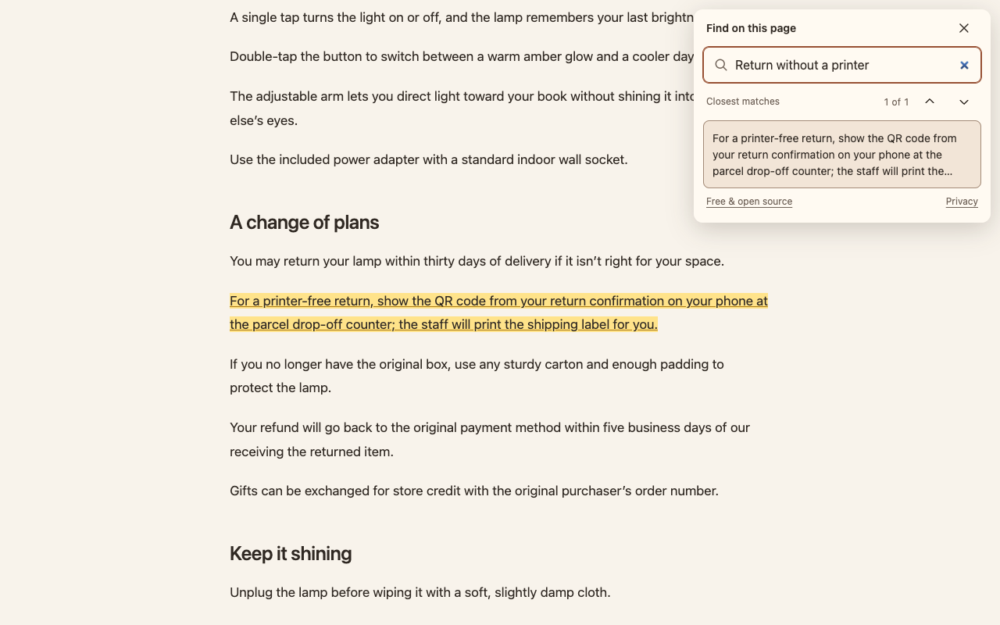

# Offline Semantic Search

**Free, open-source search that finds a passage on a webpage by describing what you mean.**

No subscription, account or API key. Search runs privately on your device. The source code is available under the [Apache 2.0 license](LICENSE), so you can use it, modify it and share it.

Ordinary browser Find looks for the exact words you type. Offline Semantic Search can find related sentences and paragraphs even when the page uses different words.

For example, search a return policy for **“How can I send it back without a printer?”** It can find a passage explaining that you can show a QR code at the counter and have the clerk print your label.

Results take you to the original text and highlight it on the page. The extension does not write answers for you, and a suggested passage may still be irrelevant.



## Start here

| What you want to do | Where to go |
| --- | --- |
| Try a search on a sample page | [Try the demo](#try-the-demo) |
| Search your own webpages | [Install in Chrome](#install-in-chrome) |
| Learn the controls | [Use the extension](#use-the-extension) |
| Understand the basic idea | [How search works](#how-search-works) |
| Change or test the code | [Development](#development) |
| Build for Safari | [Safari — experimental](#safari--experimental) |

**Release target:** desktop Chrome. Safari on Mac, iPhone and iPad remains experimental. You can build and install it from source today.

## Privacy and offline use

Search runs entirely on your device. The installed extension includes the AI models and the software needed to run them.

- Page text and search queries stay on your device.
- Searching makes no network requests and needs no account, API key or AI server.
- There is no telemetry or persistent document index.
- Closing the panel clears its search session, model worker and highlights.

**Initial setup needs internet access** to download dependencies and models. After installation, search works offline over text already loaded in your browser. Opening a new webpage may still require internet access.

The extension requests temporary access to the page when you activate it. It does not request access to every website at installation. See the [privacy policy](docs/PRIVACY.md) for details.

## Try the demo

The demo lets you try the same search engine on a fictional customer guide before installing the extension.

### 1. Get the prerequisites

Install **Node.js 22.12 or newer**, which includes **npm**, the tool that downloads this project's dependencies and runs its commands.

Download or clone this repository, then open a terminal in the `offline-semantic-search` folder. Run the following commands in order:

```sh
npm ci
npm run assets
npm run build
```

| Command | What it does |
| --- | --- |
| `npm ci` | Installs the project's dependencies using the recorded versions. |
| `npm run assets` | Downloads and verifies the bundled AI models. |
| `npm run build` | Creates the ready-to-load extension and demo in `dist/`. |

The model weights alone total about **138 MB**. The complete build is larger because it also includes the runtime, tokenizers and application files.

### 2. Open the sample page

Start the local demo server:

```sh
npm run demo
```

Keep that terminal running. Open **http://127.0.0.1:4173/demo.html** in your browser, click **Search this page**, and try:

> How can I send it back without a printer?

For a larger sample with over 200 sentences, open **http://127.0.0.1:4173/demo.html?long=1**.

Press **Ctrl+C** in the terminal to stop the server when you finish. The installed Chrome extension does not need this server.

## Install in Chrome

First complete the three build commands in [Try the demo](#1-get-the-prerequisites). You can skip starting the demo server.

1. Open `chrome://extensions` in Chrome.
2. Turn on **Developer mode**.
3. Click **Load unpacked** and select this project's **`dist`** folder.
4. Open an ordinary webpage and click the extension's toolbar icon to search it.

“Load unpacked” means installing directly from the built folder rather than from the Chrome Web Store. Keep that folder in place while the extension is installed.

You can also open the search panel with **Option+Shift+F** on Mac or **Alt+Shift+F** elsewhere. Change a conflicting shortcut at `chrome://extensions/shortcuts`.

After updating the project, run `npm run assets` and `npm run build`, then reload the extension at `chrome://extensions`.

## Use the extension

Type a question or a few words describing what you want to find. Search begins after you pause typing for about **0.4 seconds**. The first search reads the page and loads the models; later searches reuse the page's saved calculations within the open session.

| Action | Control |
| --- | --- |
| Open the panel or select the existing query | Extension icon or extension shortcut |
| Jump to a passage | Click a result |
| Move to the next result | Enter or the next arrow |
| Move to the previous result | Shift+Enter or the previous arrow |
| Close the panel | Escape or the close button |

A selected paragraph receives a pale amber highlight, with its strongest matching sentence highlighted more prominently. Read the surrounding text to decide whether it answers your question.

### If search does not find what you need

- **No close matches:** try a different description or a more specific question. Search can miss relevant passages.
- **A slow first search:** large pages take more work, and model loading adds startup time.
- **The panel cannot open:** Chrome's internal pages, the Chrome Web Store and other protected pages do not allow the extension to run. The toolbar icon displays `!` when page access fails.
- **A local HTML file cannot be searched:** enable **Allow access to file URLs** in the extension's details at `chrome://extensions`.

## How search works

Search has four stages:

1. **Read the page.** Collect visible sentences and paragraphs, including text below the current scroll position. Keep track of where each passage appears so results can highlight the original text.
2. **Find passages with related meaning.** A model called **LEAF IR** converts the query and page passages into lists of numbers called *embeddings*. Comparing these lists helps find related ideas even when the wording differs.
3. **Rank the strongest candidates.** A second model, **Ettin**, reads the query together with each of the best 40 candidates and scores how relevant they are. Weak matches are filtered out.
4. **Show and highlight the results.** Return sentences or paragraphs from the page. Section headings help interpret passages but do not appear as separate results.

Long passages are processed in overlapping pieces so their endings are covered. The extension uses the GPU when supported and falls back to the CPU when necessary. Model work runs in a separate worker to keep it off the page's main UI thread.

For implementation details, see [the search architecture](docs/ARCHITECTURE.md). For GPU modes, model sizes and performance observations, see [GPU runtime guidance](docs/GPU_ACCELERATION.md).

### What it can and cannot search

Search targets **English text currently loaded on the page**. It includes accessible same-origin frames and open shadow roots—page structures that the browser allows the extension to read.

It cannot read unloaded infinite-scroll content, inaccessible frames, closed shadow roots, PDF viewers, or text drawn in images and canvases. Hidden text, editable form values and the search panel itself are excluded. Navigation, controls and bibliography entries are excluded from result rows.

Ranking is approximate. Related text can fail to answer a question, and relevant passages can fall below the search cutoffs. Scores are not answer probabilities. Very large pages and long queries can be slow or use substantial memory. Some websites may interfere with the embedded panel.

## Development

### Edit and reload on real webpages

After the initial setup, run:

```sh
npm run dev
```

Load **`dist-dev/`** through Chrome's **Load unpacked** button. It appears as **Offline Semantic Search (Development)**. Disable the regular extension while testing to avoid shortcut conflicts.

The command watches source changes and rebuilds the development extension. After saving a change, wait for **Ready** in the terminal and reopen the panel. Reloading resets the query and model cache; your webpage stays loaded. If a build fails, fix the error and save again. Restart the command when changing the watcher itself.

The watcher uses `http://127.0.0.1:4174` for local reload notifications. Page text is not sent to it. The extra localhost permission and reload code are confined to the development build. Stop the watcher with **Ctrl+C**.

### Run checks

```sh
# Type checking, unit tests and a production build:
npm run check

# Install a test browser, then run browser tests:
npx playwright install chromium
npm run test:browser
```

Browser tests exercise the real models, highlights, GPU recovery and offline extension loading. Set `CHROMIUM_EXECUTABLE_PATH` to use an existing test Chromium if needed.

To run the small development evaluation, keep `npm run demo` running in another terminal, then run:

```sh
npm run evaluate
```

Results are saved to `artifacts/evaluation.json`. These synthetic examples help diagnose changes; they are not a broad quality benchmark or a measurement of phone performance. See [validation coverage](docs/VALIDATION.md).

### Inspect search behavior

Open the webpage's DevTools. In the Console context dropdown, select the extension's **`panel.html` iframe**. The local `semanticFindDev` tools let you inspect a search:

| Method | What it shows or changes |
| --- | --- |
| `results()` | Visible results and their scores |
| `candidates()` | Qualified passages before the top-40 shortlist |
| `scores()` | Passage scores, including excluded or weak matches |
| `metrics()` | Model loading, search timing and cache use |
| `settings()` | Current search rules and cutoffs |
| `setReranker(false)` / `setReranker(true)` | Compare LEAF alone with the default LEAF + Ettin pipeline |
| `setBackend('wasm')` / `setBackend('auto')` | Force CPU inference or restore automatic GPU selection |
| `setContextTokens(2048)` | Raise Ettin's default 1,024-token pair budget; larger values use more memory |

For example, call `semanticFindDev.results()` in that console. Settings last until the panel closes. Technical scores stay out of the normal search interface.

`semanticFindDev.exportLabels({ '1:12': true, '1:20': false })` downloads explicitly labeled examples as JSONL. IDs belong to the current page snapshot; inspect its passages before labeling. Nothing uploads automatically.

For an optional live Wikipedia performance diagnostic, run `node scripts/profile-wikipedia.mjs` after building. It uses a disposable extension and browser profile and saves reports under `artifacts/`. Live page content and timing can change.

## Safari — experimental

Safari builds require **macOS and Xcode**, including the Safari extension converter. After the initial setup:

```sh
npm run build
npm run safari
open 'safari/Offline Semantic Search/Offline Semantic Search.xcodeproj'
```

In Xcode, choose **Offline Semantic Search (iOS)** or **Offline Semantic Search (macOS)**. For a physical iPhone or iPad, select your signing team and connected device, then build and run the containing app. Enable the extension in Safari settings and allow access to the page you want to search.

On Mac, run the containing app and enable the extension in Safari settings. Unsigned development builds may require Safari's setting to allow unsigned extensions.

Running `npm run safari` again refreshes resources while preserving the Xcode project and signing settings. Use `npm run safari -- --regenerate` only when you want to recreate that project.

Safari 17+ is the initial compatibility target. Physical-device memory, keyboard behavior and performance still need validation; a simulator build does not establish phone reliability. See [device acceptance checks](docs/VALIDATION.md#device-acceptance).

## Documentation

| Document | Purpose |
| --- | --- |
| [Architecture](docs/ARCHITECTURE.md) | Retrieval, reranking, token budgets, caching and worker lifecycle |
| [GPU runtime guidance](docs/GPU_ACCELERATION.md) | Runtime selection, CPU recovery and current model assets |
| [Design](DESIGN.md) | The current interface, colors, typography and control states |
| [Validation](docs/VALIDATION.md) | Automated checks and remaining device testing |
| [Privacy policy](docs/PRIVACY.md) | Local processing and retention |
| [Third-party notices](NOTICE.md) | Model and dependency licenses |

Built by **Matthew Bajorek** at Matterialize. For privacy questions: [matthew.bajorek@matterialize.com](mailto:matthew.bajorek@matterialize.com).
