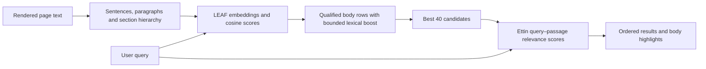

# Current search architecture

The Chrome release uses local LEAF retrieval followed by Ettin reranking. All code, tokenizers, models and WASM are bundled. The production manifest requests only `activeTab` and `scripting`; model loading is local-only and the production CSP restricts connections to the extension itself.

## Contexts and lifecycle

The toolbar action or keyboard command grants temporary access to the current page. A content script extracts accessible rendered text and maintains DOM ranges. An extension-origin iframe hosts the UI and one dedicated worker. The background service worker relays live messages; its session map contains only active connection references, not persistent user settings or a document database. Panel heartbeat messages keep the active relay available during searches. Closing the panel terminates its worker and clears highlights. A stopped/disconnected relay asks the user to reopen the panel.

Text extraction covers currently loaded DOM content, accessible same-origin frames and open shadow roots. It does not cover PDF viewers, image/canvas text, closed roots, inaccessible frames, unloaded infinite-scroll text or protected browser pages. Navigation, controls, short fragments, headings and explicitly marked bibliography entries never become result rows. Diagnostic scores may still contain excluded units.

## Retrieval

`MongoDB/mdbr-leaf-ir` uses its own BERT WordPiece tokenizer and q8 and q4f16 ONNX graphs with external weights, pinned in `model-lock.json`. Its exported pooling/projection/normalization produces 768-dimensional embeddings. Queries include LEAF's required search prefix. Sentences and paragraphs include their nearest valid local section heading, limited to 64 tokens and repeated in every window. H1 titles do not replace the query or supply body context.

LEAF has a 512-token input limit including special tokens and prefixes. Overlapping windows preserve tails. The q8 CPU fallback batches up to four windows, with an allocation-failure fallback to one. Default q4f16 WebGPU inference batches up to eight windows by default (developer comparisons can select four or sixteen). Sentence similarity aggregates query-window maxima; paragraph similarity averages window comparisons. Raw cosine scores remain available independently of bounded paragraph/section evidence. Paragraph grouping respects DOM and section boundaries; exact sentence queries can retain sentence rows.

A development evidence cutoff of 0.30 selects eligible body rows. BM25-style term matching supplies an ordering boost of at most 0.04. This is not a separate keyword retrieval path: it cannot rescue below-threshold passages. The query is used exactly as typed. This acceptance policy and shortlist size bound recall before reranking.

## Reranking

`cross-encoder/ettin-reranker-17m-v1` has a separate BPE tokenizer and FP32 WebGPU / qint8 ARM CPU ONNX encoders, plus original classifier weights, pinned in `reranker-lock.json`. Text is retokenized for each shortlisted query–passage pair; LEAF token IDs are never reused. The nearest section heading is retained as context. The encoder emits token states; CLS pooling, Dense/GELU, LayerNorm and a final Dense scalar reproduce the published classification modules.

The native pair limit is 7,999 tokens. Default inference uses overlapping 1,024-token pairs. GPU jobs are sorted by length and batched up to four pairs, with at most 2,048 padded tokens. CPU jobs remain one pair at a time. Query chunks are at most 256 tokens and section prefixes at most 64. Long body/query tails are covered, and the maximum window score orders each result. The top 40 qualified rows are reranked. Display then retains only finite raw scores at least 4 and within 2 points of the best score. These are development heuristics for suppressing weak tails, not calibrated answer-confidence thresholds; a weak best match can yield no results. Filtering applies equally to fresh and cached scores and does not affect LEAF-only mode. A relevant passage absent from the shortlist cannot be recovered.

LEAF cosine/evidence and DOM focus offsets are preserved; Ettin determines final order. Sentence focus within a paragraph still comes from LEAF and is not independently verified by Ettin. Headings never become rows or highlight targets. Related passages can still fail to answer a question; evaluation includes both improvements and regressions.

## Runtime selection and recovery

`auto` and `webgpu` select q4f16 LEAF embeddings on hardware adapters supporting `shader-f16` and FP32 WebGPU reranking; otherwise LEAF uses q8 CPU inference. `wasm` forces both existing quantized CPU models. Software adapters are excluded from automatic GPU selection. All variants and matching plain/asyncify runtime files are bundled, pinned and fetched locally. No permissions or remote inference endpoints are added.

GPU precision changes similarity scores relative to q8, including eligibility at the 0.30 cutoff. Active Wikipedia checks now use only the Apple Inc. snapshot in both default GPU and forced CPU modes. Passing these checks does not establish quality equivalence across all pages. The q4f16 export is the lowest published LEAF weight precision with FP16 computation; embedding and other unquantized weights retain floating-point storage.

A GPU initialization or inference error triggers a fresh CPU worker and reruns the current query. This is necessary because Transformers.js 4.3.0 chains session creation and inference through shared promises that remain rejected after a failed ORT call. Reusing that worker cannot reliably recover. Worker replacement clears both model sessions and all embedding/reranking caches; the panel also clears cached rankings. Messages from replaced workers cannot publish results. Automatic recovery switches to CPU for the rest of the panel lifetime; explicitly selecting a mode or reopening the panel can try GPU again.

## Comparison mode and diagnostics

In the panel frame console, `semanticFindDev.setBackend('auto')` chooses the default, `setBackend('wasm')` forces CPU, and `setBackend('webgpu', 8)` enables full GPU mode with batch size 8 (4 and 16 are also accepted). Switching modes replaces the worker and clears rankings.

`semanticFindDev.setReranker(false)` reruns the query in LEAF-only comparison mode. That mode additionally applies a question-relative cutoff and blended ordering for natural questions. The default Ettin path skips that extra cutoff to keep broader candidates. These modes therefore compare complete pipelines, not only classifier scores on an identical candidate list; `retrievalRank` in evaluations records the pre-reranking rank for a direct within-pipeline comparison.

`results()` returns visible rows with `rerankScore` and preserved LEAF scores. `candidates()` returns all qualified pre-shortlist rows. `scores()` returns individual passage diagnostics, including headings/weak matches. `metrics()` includes model loads, embedding/pair counts, cache hits, total search time and reranking time; reranking time includes its model load. It also reports `embeddingRuntime`, `rerankerRuntime`, `embeddingInferenceMs`, `embeddingBatchSize` and `rerankBatches`. Runtime fields distinguish actual device/precision from requested preference and record GPU failure reasons after recovery. Fallback metrics describe the successful CPU attempt; they exclude the failed GPU attempt and worker restart. `rerankLongestPair` covers newly inferred pairs and is zero on fully cached runs. Developer diagnostic methods are explicitly invoked local tools, not telemetry.

The worker caches completed embeddings for current snapshot text and up to 512 completed rerank pair scores. The panel caches eight complete query rankings keyed by snapshot, query, mode and context budget. Text/heading edits invalidate affected inputs. Generation IDs and yields between inference batches/pairs prevent cancelled searches from publishing stale results. Models and caches are scoped to each open panel; separate tabs can create separate allocations.

See [GPU_ACCELERATION.md](GPU_ACCELERATION.md), [VALIDATION.md](VALIDATION.md) and [PRIVACY.md](PRIVACY.md).
